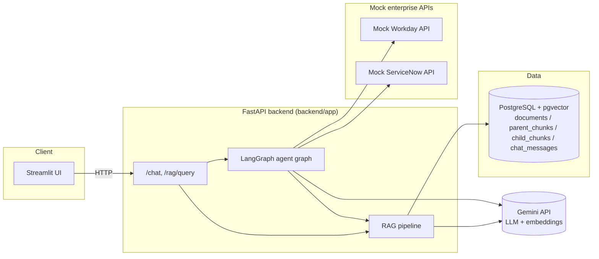
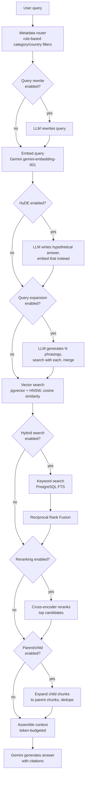
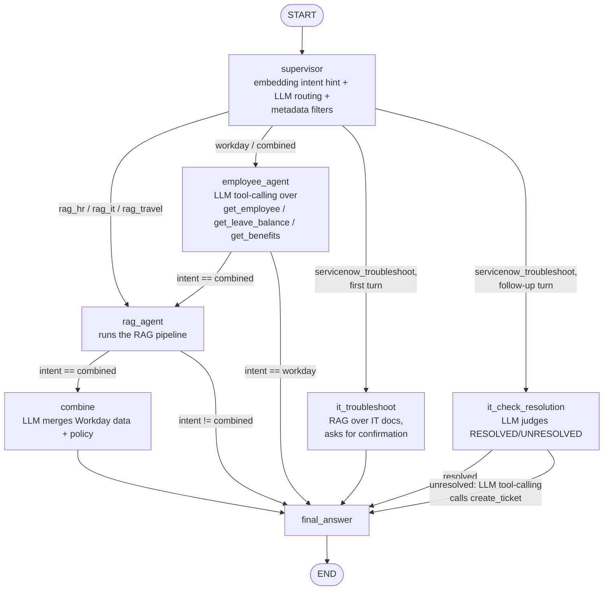

# Architecture

## System overview

## RAG pipeline (`backend/app/rag/pipeline.py`)

Every stage below is a real, separately-toggleable step -- see `.env.example`
for the `ENABLE_*` flags, and `backend/app/rag/pipeline.py` for the
orchestrating function. This is also exactly what the debug trace
(`trace: [...]` in API responses, or the Streamlit expander) shows you,
stage by stage, for any query.

## Agent graph (`backend/app/agents/graph.py`)

Notes:
- `rag_agent` and `employee_agent` are each reached from two different
  routes; the conditional edges *after* those nodes check `state["intent"]`
  (set once by the supervisor and never overwritten) to decide whether to
  continue toward `combine` or go straight to `final_answer`.
- The `it_troubleshoot` / `it_check_resolution` split is what makes example
  query 5 ("try troubleshooting and create a ticket if it still doesn't
  work") a genuinely **conditional, multi-turn** workflow rather than always
  creating a ticket: `state["troubleshooting_resolved"]` persists across
  turns via the LangGraph `MemorySaver` checkpointer (keyed by
  `session_id`), and decides which of the two nodes handles the *next*
  message in the same session. See `backend/app/agents/it_agent.py`'s
  module docstring for the full walkthrough.
- Every node appends to `state["trace"]` (concatenated automatically via
  LangGraph's `operator.add` reducer -- see `backend/app/agents/state.py`),
  which is what the "User → Supervisor → Selected agent → Tool call → Tool
  parameters → Tool result → Next node → Final answer" debug view is built
  from.
