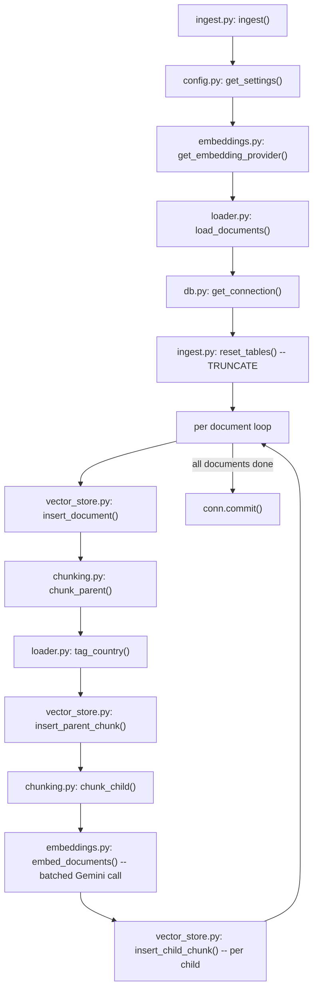
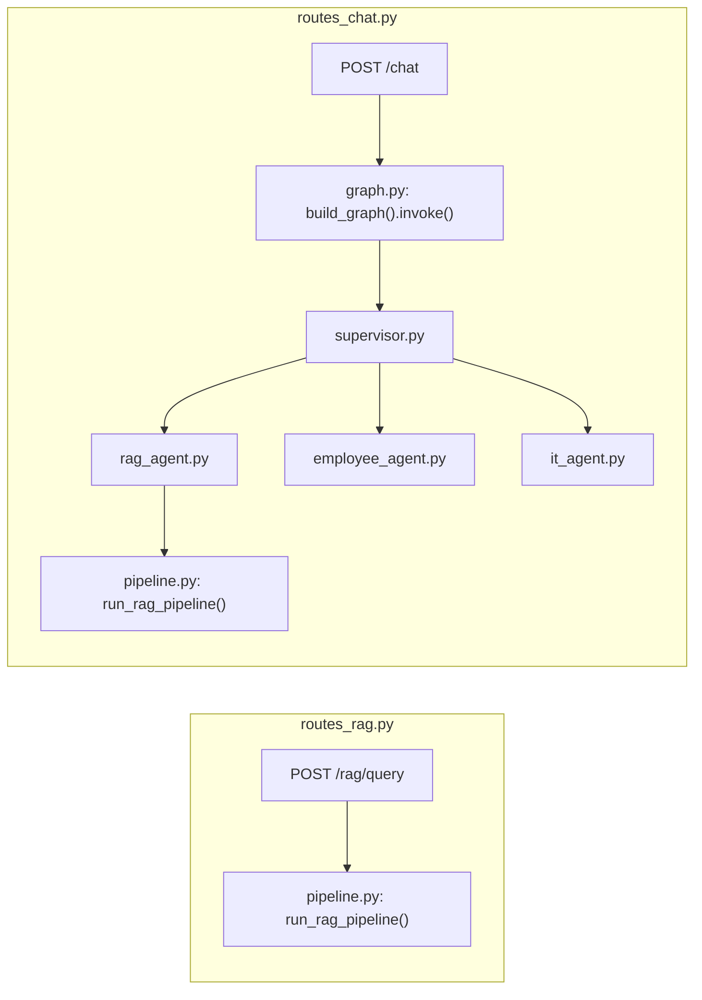
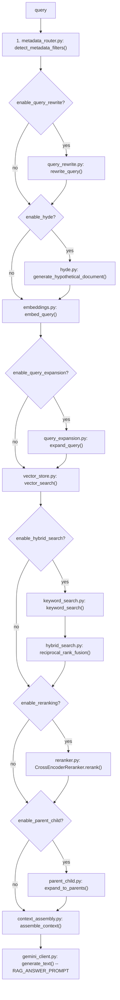

# Pipeline walkthrough: every file, in execution order

This doc is for someone opening this codebase for the first time. It does
not explain *why* each RAG concept exists (that's `docs/concepts/*.md`) or
how to *run* the system (that's the root `README.md`). It answers one
question: **when I run ingestion, or send a query, which Python files
actually execute, in what order, and what does each one do?**

Read it next to a running system: run `make ingest` and `/rag/query` /
`/chat` as you go (see the ingestion + query end-to-end steps in
`README.md`), and match the terminal output (including the `print()`
statements added to `ingest.py`, `embeddings.py`, and `vector_store.py`) and
the JSON `trace` array against the steps below.

Two independent flows, covered separately:

1. **Ingestion** — `make ingest`, a one-time/rerunnable CLI script.
2. **Query** — `/rag/query` (pipeline only) and `/chat` (agent routing +
   pipeline), both live inside the running FastAPI backend.

---

## Part 1 — Ingestion: `make ingest`

`make ingest` runs `python -m backend.app.ingestion.ingest`, which calls
`ingest()` in [`backend/app/ingestion/ingest.py`](../backend/app/ingestion/ingest.py).
That one function is the entire orchestrator — everything else in this
section is a file it calls into, in this order.

### Step-by-step, file by file

**1. `backend/app/config.py` — `get_settings()`**
Reads `.env` once into a cached `Settings` object (Pydantic). Ingestion
reads `parent_chunk_max_chars`/`overlap`, `child_chunk_max_chars`/`overlap`,
`embedding_provider`, `embedding_dims`, and `database_url` from here — every
number you see in the chunking prints traces back to a field in this file.

**2. `backend/app/rag/embeddings.py` — `get_embedding_provider(settings)`**
Returns a `GeminiEmbeddingProvider` (default) or `LocalSentenceTransformerEmbedding`,
chosen by `settings.embedding_provider`. Both implement the same three-method
interface (`embed_documents`, `embed_query`, `.dims`) — this is the "swap
point" the module docstring describes; nothing downstream cares which one is
active. Constructed once, at the top of `ingest()`, before any documents are
touched.

**3. `backend/app/ingestion/loader.py` — `load_documents()`**
Walks `data/raw_docs/**`, and for every `.md`/`.pdf` file whose parent folder
is `hr`/`it`/`travel`/`personal`:
- **Markdown** (`_load_markdown`): strips an optional OKF YAML frontmatter
  block (`_parse_okf_frontmatter` — see `docs/concepts/okf.md`) *before*
  regex-extracting the title (`# Heading`) and effective date
  (`**Effective date:** YYYY-MM-DD`), so frontmatter never pollutes the
  chunked/embedded text.
- **PDF** (`_load_pdf`): tries `pypdf` text-layer extraction first; if a
  page averages under `MIN_CHARS_PER_PAGE_BEFORE_OCR_FALLBACK` (20) chars,
  falls back to `_ocr_pdf()` (renders pages to images via `pdf2image`, reads
  them via `pytesseract`). A PDF that fails both is skipped with a printed
  warning, not silently ingested empty.

Returns a `list[RawDocument]` — one dataclass instance per source file, held
entirely in memory (this project's corpus is small by design; there's no
streaming/pagination here).

**4. `backend/app/db.py` — `get_connection()`**
A `psycopg_pool.ConnectionPool` singleton, `register_vector`-configured so
pgvector's `Vector` type round-trips correctly. `ingest()` opens one
connection for the whole run and does all inserts through it, committing once
at the very end — not per document.

**5. `backend/app/ingestion/ingest.py` — `reset_tables(conn)`**
`TRUNCATE documents, parent_chunks, child_chunks CASCADE`. This single line
is what makes `make ingest` idempotent/rerunnable — every run starts from
empty tables, so there's no upsert logic to get wrong.

**6. `backend/app/rag/vector_store.py` — `insert_document(...)`**
One row per source file into `documents`. This is also where the OKF fields
(`doc.doc_type`/`tags`/`related`/`stale_after`, built into a
`document_metadata` dict a few lines up in `ingest.py`) land in the
`documents.metadata` JSONB column — additive, no migration needed for OKF.

**7. `backend/app/rag/chunking.py` — `chunk_parent(text, max_chars=1800, overlap=200)`**
Paragraph-aware sliding window: walks `text.split("\n\n")`, accumulating
paragraphs into a chunk until the next one would exceed `max_chars`, then
closes it and starts the next chunk with the last `overlap` characters of
the one just closed (so context survives a chunk boundary). Pure function —
no DB, no embeddings — returns `list[ParentChunk]`.

**8. `backend/app/ingestion/loader.py` — `tag_country(parent.content)`**
Run once per parent chunk (not per document — see the module docstring:
country is a *section* property, not a whole-document one). Scans the
chunk's text for a `### <Country Name>` heading matching
`COUNTRY_HEADING_MAP` and returns an ISO code (`"IN"`, `"US"`, …) or `None`.
This is exactly what lets a query about "parental leave in India" filter
down to the one parent chunk that actually covers India, inside a document
that also covers three other countries.

**9. `backend/app/rag/vector_store.py` — `insert_parent_chunk(...)`**
One row per parent chunk into `parent_chunks`, `metadata={"country": ...}`
if `tag_country` found one.

**10. `backend/app/rag/chunking.py` — `chunk_child(parent.content, max_chars=350, overlap=50)`**
A plain fixed-size character sliding window (step = `max_chars - overlap`)
over the *parent's* text — deliberately simpler than `chunk_parent`, since
child chunks exist only to give the embedding model a small, focused span;
paragraph boundaries don't matter here.

**11. `backend/app/rag/embeddings.py` — `embedding_provider.embed_documents(child_texts)`**
Called **once per parent chunk**, with all of that parent's children's text
in one list — not once per child chunk. Inside `GeminiEmbeddingProvider`:
- `_throttle()` sleeps if less than `MIN_SECONDS_BETWEEN_REQUESTS` (2s) has
  elapsed since the last Gemini call on this instance — spreads requests out
  regardless of which parent chunk they came from.
- `_embed_batch(texts, task_type="RETRIEVAL_DOCUMENT")` sends up to
  `BATCH_SIZE` (10) texts in a single `embed_content` HTTP call, retried
  with exponential backoff specifically on HTTP 429 (`@retry` +
  `retry_if_exception(_is_rate_limit_error)`).
- `output_dimensionality=768` is passed explicitly — Gemini's embedding
  model natively outputs 3072 dims (via Matryoshka Representation Learning)
  but this project's `child_chunks.embedding` column is `VECTOR(768)`.

This is the single most expensive part of ingestion in terms of Gemini
quota, which is why it's batched per-parent rather than per-child.

**12. `backend/app/rag/vector_store.py` — `insert_child_chunk(...)`**
One row per child chunk into `child_chunks`: content, char offsets, token
estimate, the actual embedding vector, `embedding_model` (a string like
`gemini:models/gemini-embedding-001`, so you can tell which model produced
which row if you ever change providers), and `metadata` inherited from the
parent (the country tag).

**13. Back in `ingest()`: `conn.commit()`, then the final summary print.**
Nothing is visible in Postgres until this commit — if `make ingest` crashes
partway through, the `TRUNCATE` from step 5 already happened but the new
rows haven't been committed, so a re-run from scratch is always the correct
recovery (this is why the docstring calls the whole script idempotent).

### Files touched, ingestion only

| File | Role |
|---|---|
| `backend/app/ingestion/ingest.py` | Orchestrator — the only file with a `__main__` |
| `backend/app/ingestion/loader.py` | Filesystem → `RawDocument` (markdown parsing, OKF frontmatter, PDF/OCR, country tagging) |
| `backend/app/rag/chunking.py` | `RawDocument.raw_text` → parent chunks → child chunks (pure, no I/O) |
| `backend/app/rag/embeddings.py` | Child chunk text → embedding vectors (Gemini API) |
| `backend/app/rag/vector_store.py` | `insert_document`/`insert_parent_chunk`/`insert_child_chunk` — the only writers to these tables |
| `backend/app/config.py` | Chunk sizes, embedding provider/dims, DB URL |
| `backend/app/db.py` | Connection pool ingestion writes through |
| `db/migrations/*.sql` (run once via `db/migrate.py`, not by `ingest.py`) | Table shapes ingestion's INSERTs assume already exist |

---

## Part 2 — Query: `/rag/query` and `/chat`

There are two entry points, and the second one calls into the first:

`/rag/query` is the pipeline in isolation — no routing, no tools, one LLM
call. `/chat` decides *whether* to call the pipeline at all (and how to
scope it), via the agent graph. Read `/rag/query` first.

### 2a. `/rag/query` — the pipeline alone

**`backend/app/api/routes_rag.py` — `query_rag(request)`**
Builds a `Trace(enabled=...)` (from `backend/app/trace/trace.py`), builds a
`filters` dict from any explicit `category`/`country` in the request body,
and calls `run_rag_pipeline()`. Everything else happens inside that one
function.

**`backend/app/rag/pipeline.py` — `run_rag_pipeline()`**, ten stages,
straight-line, each wrapped in `if settings.enable_x:`:

1. **`backend/app/rag/metadata_router.py` — `detect_metadata_filters(query)`**
   Plain regex/keyword matching (not an LLM, not embeddings) against
   `CATEGORY_KEYWORDS` (sourced from every skill's `keywords` field — see
   `backend/app/skills/registry.py` — so adding a category means adding a
   `SKILL.md`, not editing this file) and a hardcoded `COUNTRY_KEYWORDS`
   table. Caller-supplied filters (e.g. from the agent graph) override this
   guess — see `effective_filters = {**detected_filters, **(filters or {})}`.

2. **`backend/app/rag/query_rewrite.py` — `rewrite_query()`** *(off by default)*
   One LLM call (`llm/prompts.py`'s `QUERY_REWRITE_PROMPT`) via
   `backend/app/llm/gemini_client.py`'s `generate_text()` to clean up the raw
   query before it's used for anything downstream.

3. **`backend/app/rag/hyde.py` — `generate_hypothetical_document()`** *(off by default)*
   One LLM call to write a fake "policy-answer-shaped" passage; if enabled,
   *this* text gets embedded instead of the query itself.

4. **`backend/app/rag/embeddings.py` — `embedding_provider.embed_query(embed_target)`**
   Same `GeminiEmbeddingProvider` class as ingestion, but `task_type="RETRIEVAL_QUERY"`
   this time (Gemini's embedding model weights queries and documents
   differently internally) and **not throttled** — a single interactive
   query doesn't risk bursting the rate limit the way bulk ingestion does.

5. **`backend/app/rag/query_expansion.py` — `expand_query()`** *(off by default)*
   One LLM call generating N alternate phrasings; each gets its own
   `embed_query()` + `vector_search()` call, later deduped by
   `pipeline.py`'s `_dedupe_vector_hits()` (keeps the highest-similarity
   occurrence of each chunk id).

6. **`backend/app/rag/vector_store.py` — `vector_search(query_embedding, top_k, filters)`**
   The actual pgvector query: `ORDER BY embedding <=> %s LIMIT %s`, where
   `<=>` is cosine *distance* (`1 - similarity`) — see `docs/concepts/hnsw.md`
   for the index that makes this fast at scale. `build_filter_clause()`
   (shared with keyword search, below) turns `{"category": "hr", "country":
   "IN"}` into a `WHERE` fragment. This function now also prints every
   ranked result straight to the backend's terminal (rank, cosine
   similarity, chunk id, content preview) — the change made earlier this
   session.

7. **`backend/app/rag/keyword_search.py` — `keyword_search()`** *(part of hybrid search, on by default)*
   PostgreSQL full-text search: `ts_rank_cd` against `content_tsv` — explicitly
   **not** BM25 (see `docs/concepts/fts_vs_bm25.md` for the three concrete
   differences). Same `build_filter_clause()` as vector search.

   **`backend/app/rag/hybrid_search.py` — `reciprocal_rank_fusion(vector_hits, keyword_hits, k=60)`**
   Combines the two ranked lists by *rank* (`1/(k+rank)` per list, summed),
   never by raw score — vector similarity and `ts_rank_cd` live on
   incompatible scales, so this is the only way to combine them meaningfully.
   See `docs/concepts/rrf.md`.

8. **`backend/app/rag/reranker.py` — `CrossEncoderReranker.rerank(query, candidates, top_n)`**
   A `sentence-transformers` `CrossEncoder` (default
   `cross-encoder/ms-marco-MiniLM-L-6-v2`) scores each `(query, chunk)` pair
   *jointly* — unlike the bi-encoder embeddings used for vector search, it
   can see the query and chunk text together, which catches things cosine
   similarity misses (e.g. negation). See `docs/concepts/reranking.md`.
   Cached as a module-level singleton (`get_reranker`) since loading the
   model is the slow part.

9. **`backend/app/rag/parent_child.py` — `expand_to_parents(reranked_hits)`**
   For each surviving *child* chunk, fetches its *parent* chunk
   (`vector_store.py`'s `get_parent_chunk`) — search small for precision,
   answer with the bigger surrounding context. Multiple children from the
   same parent collapse into one `ParentContext` so the LLM never sees
   duplicate content. See `docs/concepts/parent_child_retrieval.md`.

10. **`backend/app/rag/context_assembly.py` — `assemble_context(parent_contexts, max_tokens)`**
    Concatenates parent chunks into one context string (`[Source N: title]`
    headers), stopping once `estimate_token_count` (word-count based, not a
    real tokenizer — see `chunking.py`) would exceed `context_max_tokens`.
    Also builds the `Citation` list returned to the caller.

11. **`backend/app/llm/gemini_client.py` — `generate_text(prompt, settings)`**
    The final answer call: `RAG_ANSWER_PROMPT` from `backend/app/llm/prompts.py`,
    filled with the assembled context, the original query, and — if a skill
    matched — that skill's `body` as extra domain guidance (see 2b below).
    Every LLM call in this entire project, RAG or agentic, funnels through
    this one function (or its tool-calling sibling in `agents/tool_calling.py`) —
    there is exactly one place that talks to Gemini's chat model.

Every stage above calls `trace.step(node, event, data)` — that's the `trace`
array you see in the API response. See `backend/app/trace/trace.py`.

### 2b. `/chat` — agent routing, then the same pipeline

**`backend/app/api/routes_chat.py` — `chat(request)`**
Loads (or lazily builds, via `build_graph()`) a module-level LangGraph
instance, saves the incoming user message to `chat_messages` (Postgres),
invokes the graph with `thread_id = session_id`, then saves the assistant's
reply + trace back to `chat_messages`. This DB write is what
`GET /chat/{session_id}/history` reads back later — independent of
LangGraph's own (in-memory-only) state.

**`backend/app/agents/graph.py` — `build_graph(settings)`**
Wires every node below into a `StateGraph(AgentState)` (state schema:
`backend/app/agents/state.py` — a `TypedDict` with two special reducer
fields, `messages` via `add_messages` and `trace` via `operator.add`).
Compiled with a `MemorySaver` checkpointer keyed by `thread_id` — this is
what makes the two-turn IT ticket flow (below) actually "remember" turn 1
when turn 2 arrives.

**`backend/app/agents/supervisor.py` — `supervisor_node(state, settings)`**
Always the first node:
1. If `ENABLE_EMBEDDING_INTENT_CLASSIFIER` is on: `backend/app/rag/intent_classifier.py`'s
   `IntentClassifier.classify(query)` embeds the query and finds the closest
   of a small hand-written set of example utterances per route (cosine
   similarity) — a cheap, LLM-free hint.
2. Builds `SUPERVISOR_ROUTING_PROMPT` (`llm/prompts.py`) from every skill's
   `name`/`description` (`backend/app/skills/registry.py`'s `load_skills()`
   — parses `backend/app/skills/*/SKILL.md`'s YAML frontmatter), includes
   the embedding hint as advisory text, and calls `generate_text()`. The
   LLM's answer is the real routing decision — it can ignore the hint.
3. Also runs `metadata_router.py`'s `detect_metadata_filters()` again here
   (rule-based, free) so `metadata_filters` is on `state` for whichever
   agent runs next.

**`backend/app/agents/graph.py` — `route_after_supervisor(state)`**
A plain Python function reading `state["intent"]`, returning one of
`rag_agent` / `employee_agent` / `it_troubleshoot` / `it_check_resolution`
(the last two decided by `agents/it_agent.py`'s `route_it_entry`, based on
`state["troubleshooting_resolved"]`).

**If routed to `rag_agent`** — `backend/app/agents/rag_agent.py` —
`rag_agent_node(state, settings)`: looks up the document `category` for the
matched route (`ROUTE_TO_CATEGORY`, sourced from each skill's `category`
field), folds it into `filters`, looks up that skill's `body` via
`skills/registry.py`'s `get_skill()` as `skill_guidance`, then calls the
**exact same** `run_rag_pipeline()` from part 2a — nothing about the
pipeline itself differs between `/rag/query` and `/chat`.

**If routed to `employee_agent`** — `backend/app/agents/employee_agent.py` —
`employee_agent_node(state, settings)`: builds three per-employee tools via
`backend/app/agents/tools_workday.py`'s `build_workday_tools(employee_id, settings)`
(each tool closes over `employee_id` so the LLM can never supply/hallucinate
one), then runs the shared tool-calling loop in
`backend/app/agents/tool_calling.py`'s `run_tool_agent()`: bind tools → LLM
decides which to call → `backend/app/clients/workday_client.py` makes the
actual `httpx` GET to the mock Workday API (`:8001`) → result fed back to the
LLM → repeat until it stops calling tools. If the route is `combined`, the
employee's `country` (from `get_employee`'s result) is extracted and merged
into `metadata_filters`, so the RAG search that runs *next* can be scoped to
the employee's own country without the user ever typing a country name.

**If routed to `it_troubleshoot` / `it_check_resolution`** —
`backend/app/agents/it_agent.py`: turn 1 (`it_troubleshoot_node`) runs the
RAG pipeline scoped to `category=it`, appends a "did that fix it?" question,
and sets `troubleshooting_resolved=False`. Turn 2, for the *same*
`session_id` (`route_it_entry` sees `troubleshooting_resolved is False`),
goes to `it_check_resolution_node`, which asks the LLM (`TROUBLESHOOTING_RESOLVED_PROMPT`)
whether the employee's new message means RESOLVED or UNRESOLVED; if
unresolved, it runs the same `run_tool_agent()` loop against a
`create_ticket` tool (`backend/app/agents/tools_servicenow.py` →
`backend/app/clients/servicenow_client.py` → mock ServiceNow API on `:8002`).

**`backend/app/agents/graph.py` — `combine_node(state, settings)`**
Only reached when `intent == "combined"` (both `employee_agent` and
`rag_agent` ran first): fills `COMBINE_PROMPT` with the Workday answer and
the RAG answer, one more `generate_text()` call, to actually apply the
policy to the employee's real data rather than just concatenating both
answers.

**`backend/app/agents/graph.py` — `final_answer_node(state)`**
Terminal node for every route — fills in `final_answer`/`citations` for the
routes that don't already set them (pure RAG, pure Workday) and always
appends one closing trace step, so every path ends the same way regardless
of which nodes it passed through.

### Files touched, query only (beyond the shared pipeline files in Part 1's table)

| File | Role |
|---|---|
| `backend/app/api/routes_rag.py` | `/rag/query` — pipeline only |
| `backend/app/api/routes_chat.py` | `/chat` — builds/invokes the graph, persists `chat_messages` |
| `backend/app/agents/graph.py` | Wires nodes + conditional edges into a `StateGraph`; owns the `MemorySaver` checkpointer |
| `backend/app/agents/state.py` | `AgentState` TypedDict — the only shape passed between nodes |
| `backend/app/agents/supervisor.py` | Routing decision (embedding hint + LLM) |
| `backend/app/agents/rag_agent.py` | Wraps `run_rag_pipeline()` for RAG-routed intents |
| `backend/app/agents/employee_agent.py` | Workday tool-calling |
| `backend/app/agents/it_agent.py` | Troubleshoot/ticket two-turn workflow |
| `backend/app/agents/tool_calling.py` | Shared bind-tools/invoke/execute loop |
| `backend/app/agents/tools_workday.py`, `tools_servicenow.py` | LangChain `StructuredTool` wrappers, per-employee |
| `backend/app/agents/retry.py` | Retry wrapper around the mock-API httpx calls |
| `backend/app/clients/workday_client.py`, `servicenow_client.py` | Plain `httpx` calls to the mock APIs |
| `backend/app/rag/metadata_router.py` | Rule-based category/country filter detection (shared by pipeline + supervisor) |
| `backend/app/rag/query_rewrite.py`, `query_expansion.py`, `hyde.py` | Optional pre-retrieval LLM stages (all off by default) |
| `backend/app/rag/intent_classifier.py` | Embedding-similarity routing hint |
| `backend/app/rag/vector_store.py`, `keyword_search.py`, `hybrid_search.py`, `reranker.py`, `parent_child.py`, `context_assembly.py` | The ten pipeline stages (Part 2a) |
| `backend/app/skills/registry.py` + `backend/app/skills/*/SKILL.md` | Route descriptions, category/keywords, per-domain answer guidance |
| `backend/app/llm/gemini_client.py`, `prompts.py` | The one LLM entry point + every prompt template |
| `backend/app/trace/trace.py` | Debug trace mechanism (both the pipeline's `Trace` object and the graph's `new_trace_steps()`) |

---

## How this maps to what you can actually observe

- **Terminal prints** (added this session): `make ingest`'s console output
  now narrates every document/parent/child/embedding-batch step in order —
  literally the numbered list in Part 1. Any `/rag/query` or `/chat` call
  prints `vector_search()`'s ranked results to whichever terminal is running
  `make run-backend` — Part 2a, step 6.
- **The `trace` JSON field**: every numbered stage in both flowcharts above
  that calls `trace.step(...)` or returns `new_trace_steps(...)` shows up
  here, in order, with real data (similarity scores, RRF scores, tool
  call args/results). This is the same information as the prints, but
  structured and returned to the caller (API response / Streamlit's
  expandable trace) rather than only visible server-side.
- **Postgres**: the ground truth for what ingestion actually produced —
  see the SQL checks in `README.md`'s "End-to-end testing lifecycle," step 2.

If a query behaves unexpectedly, use this doc to find which numbered stage's
file to open next, rather than guessing.
